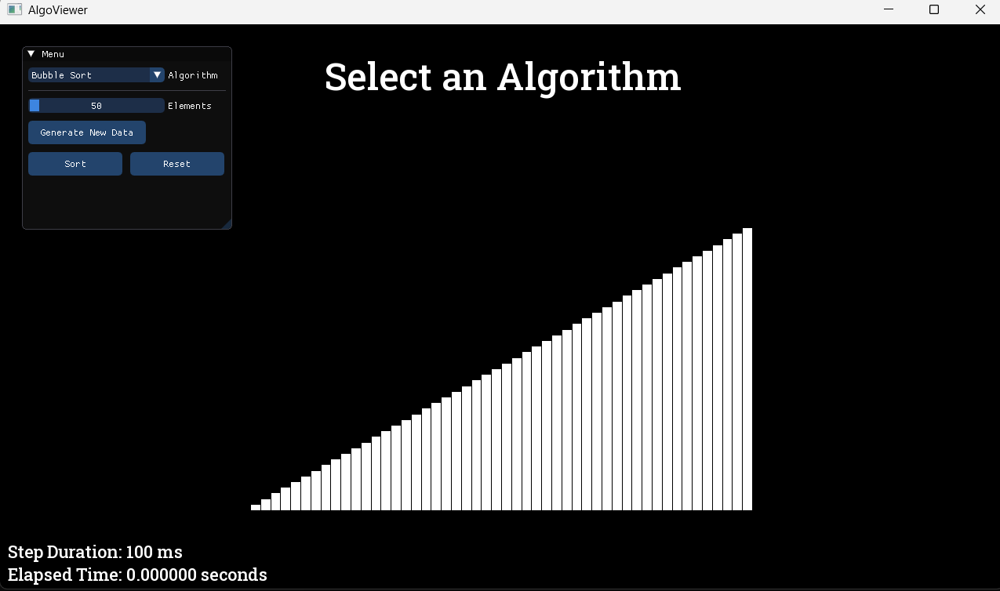
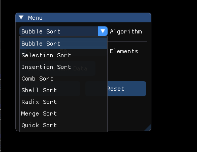
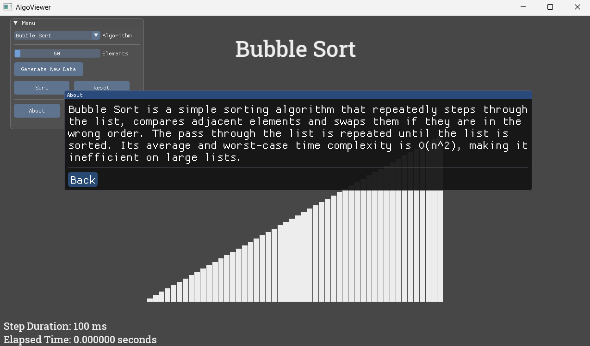

# AlgoViewer

## Table of Contents
- [Overview](#overview)
- [Features](#features)
- [Screenshots / Demo](#screenshots--demo)
- [Installation](#installation)
- [Build From Source](#build-from-source)
  - [Requirements](#requirements)
  - [Using build.bat](#using-buildbat)
  - [Using CMake](#using-cmake)
- [Supported Algorithms](#supported-algorithms)
- [Future Improvements](#future-improvements)
- [Contributors](#contributors)

## Overview
AlgoViewer is a C++ application built with SFML and ImGui (via ImGui-SFML) that visualizes and compares sorting algorithms in real time. It offers an interactive interface where users can observe algorithm behaviours (e.g., swaps, comparisons, sorted portions), adjust parameters, and explore how different sorts perform and evolve visually.

## Features
- Dropdown Selection Menu for the algorithms.
- Visual Representation of ordered data.
- Adjustable and Mobile Menu window.
- Dataset Randomization at the click of a button.
- Time Elapsed Clock for the Sorts.
- Live Sorting Visualization.

## Screenshots / Demo

### Main View

---
### Sorts List

---
### Sorting Demo

---
### About Menu Example

---

## Installation
> ⚠️ Note \
> OS Requirement: Windows

- You can install the latest version of the exceutable from the Releases Section on the GitHub Repository.

## Build From Source
Alternatively, if you would like to build from source, then there are a few ways you can do that.

- ### Requirements
    - OS Windows, Version: ??? (Haven't checked backwards compatibility, but used Windows 11 while building.)
    - CMake Version >= 3.15
    - Compiler (MSVC/MinGW)
    - Dependencies (SFML, ImGui-SFML, ImGui) -> this is included in the source code, check `libs` folder.

- ### Using build.bat
    So I did include a `build.bat` file in the source code, if you do not have CMake or are not familiar with it. Just simply running this file (on Windows) can build you an executable, although it does take a while. \
    **What it does**: It recursively looks through files in the folders and links them, instead of you having to type `g++ main.cpp etc. etc.`, then makes an executable.

- ### Building with CMake
    ```
    cd to/your/workspacefolder/
    mkdir build                     // make a build folder for .o files
    cd build
    cmake ..
    cmake --build .
    ```
## Supported Algorithms
- Bubble Sort
- Selection Sort
- Insertion Sort
- Comb Sort
- Shell Sort
- Radix Sort
- Merge Sort
- Quick Sort

## Future Improvements
- ### A Main Menu to select the type of algorithm to visualize.
- ### Add more sorts.
- ### Add more variety of algorithms (Shortest path, BFS etc.)
- ### Implement visualizations for Data Structures
    - This could just be another app on its own, maybe.

## Contributors
[](http://github.com/AlyKazani04)
[](https://github.com/eshalad01)
[](https://github.com/saroshmorani)
